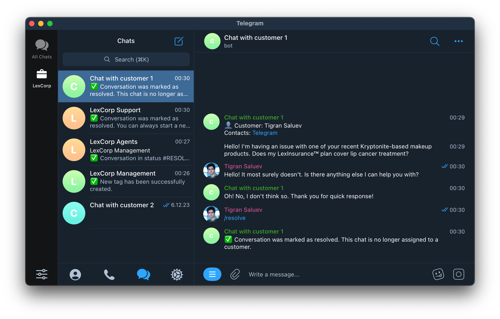

# Suppgram — Telegram-based support system

## What problem does it solve?

Small and medium-sized b2c businesses often face the necessity to hire multiple support agents to handle 
the flow of incoming requests from customers. But enterprise support systems are very expensive and quite
complex.

Suppgram provides a simple Telegram-based interface for your support agents, and a multitude of ways for your
customers to reach them.

## How does it work?

### 1. Customers contact your support service via a multitude of different mediums (Telegram bot, e-mail, etc.).

### 2. New customer requests are shown to your support agents, with possibility to assign a conversation to an agent or mark it with tags.

### 3. Support agents are assigned to conversations and are able to chat with the customers via a unified interface, eventually marking chats as resolved.

## How to use it?

See [Quickstart](https://suppgram.readthedocs.io/en/latest/usage/quickstart/)!

## How to contribute?

See [Contribution guide](https://suppgram.readthedocs.io/en/latest/development/contribution_guide/)!
