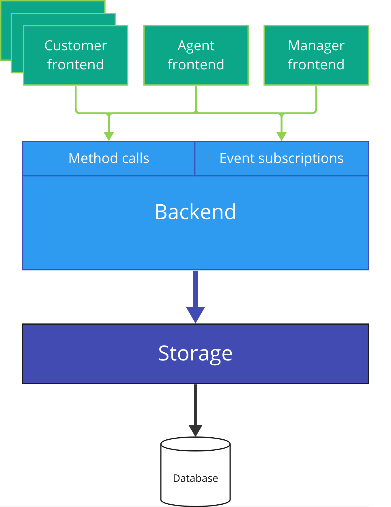

# Architecture overview

Suppgram follows standard [three-tier architecture](https://www.ibm.com/topics/three-tier-architecture), 
with layers depicted on the image below.

**Customer frontend** is the component responsible for interacting with the customers. 
You may connect multiple customer frontends to your Suppgram instance, e.g. connect a Telegram bot
and PubNub integration. For the list of supported customer frontends, see [Customer frontends](customer_frontends.md).

**Agent frontend** is the component providing user interface for your support agents.
Currently only Telegram frontend is available; see [Agent frontend](agent_frontends.md).

**Manager frontend** is the component providing user interface for managing the support system.
It shows new conversations, allows labelling them with tags and assigning agents.
This is the most complex frontend component and currently only Telegram frontend is available; 
see [Manager frontend](manager_frontends.md).

**Backend** is the component performing the support system business logic, frontend- and storage-agnostic.
Two main ways of interacting with the backend are direct method calls and subscriptions to events 
([Observer pattern](https://refactoring.guru/design-patterns/observer) is used to avoid
cyclic dependencies). Currently only local backend is available, but remote backends with HTTP/gRPC API 
and distributed message queues like Kafka for events may be implemented if necessary. See [Backend](backends.md).

**Storage** is the component encapsulating functionality related to storing data persistently in a database,
allowing to integrate Suppgram into systems with various tech stacks. For the list of supported storages,
see [Storages](storages.md).
