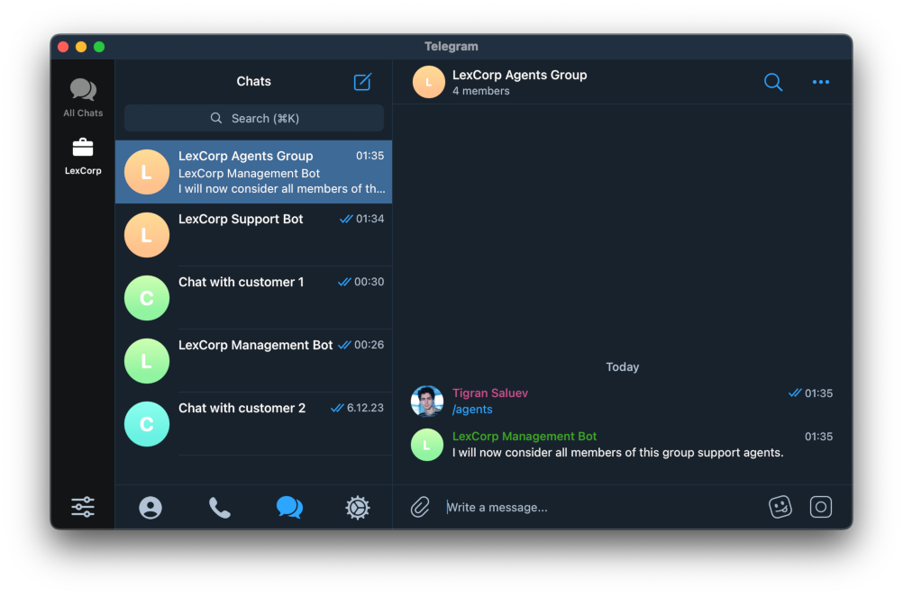
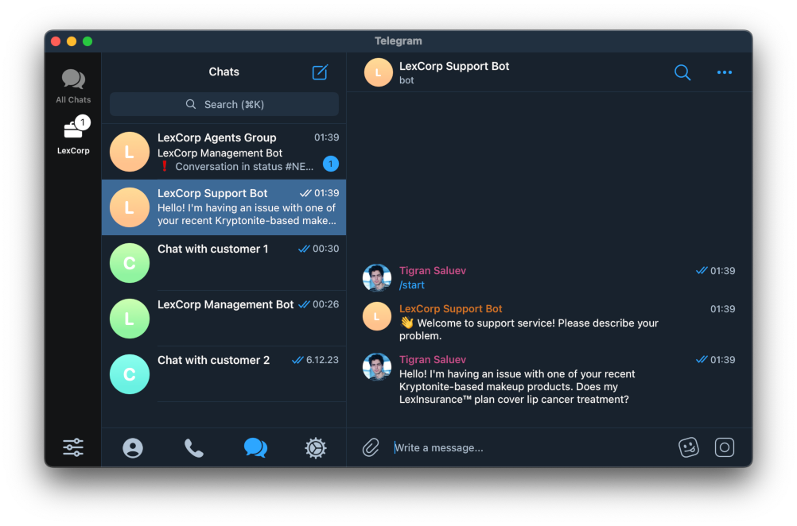
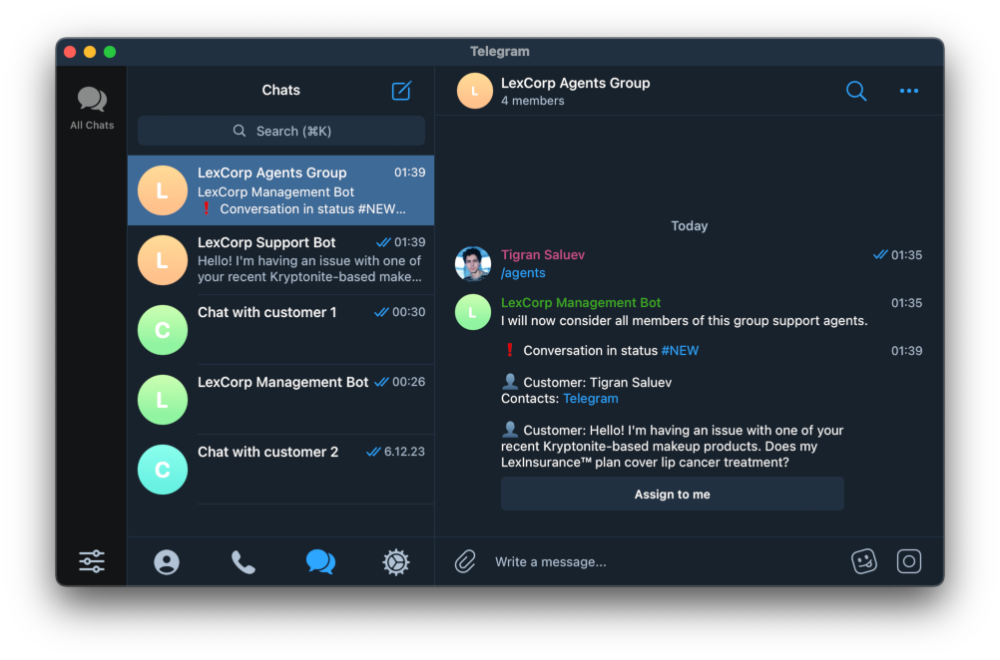
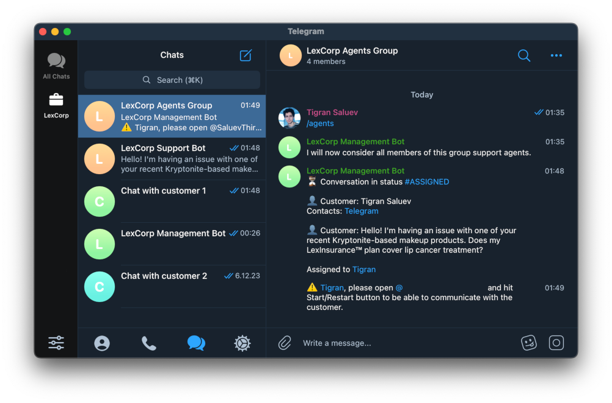
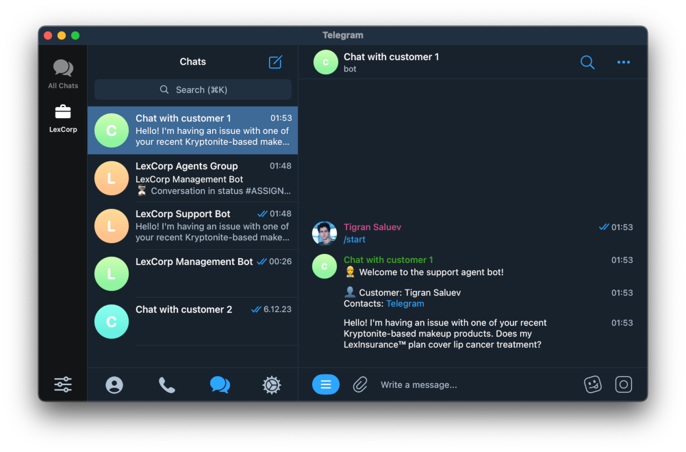
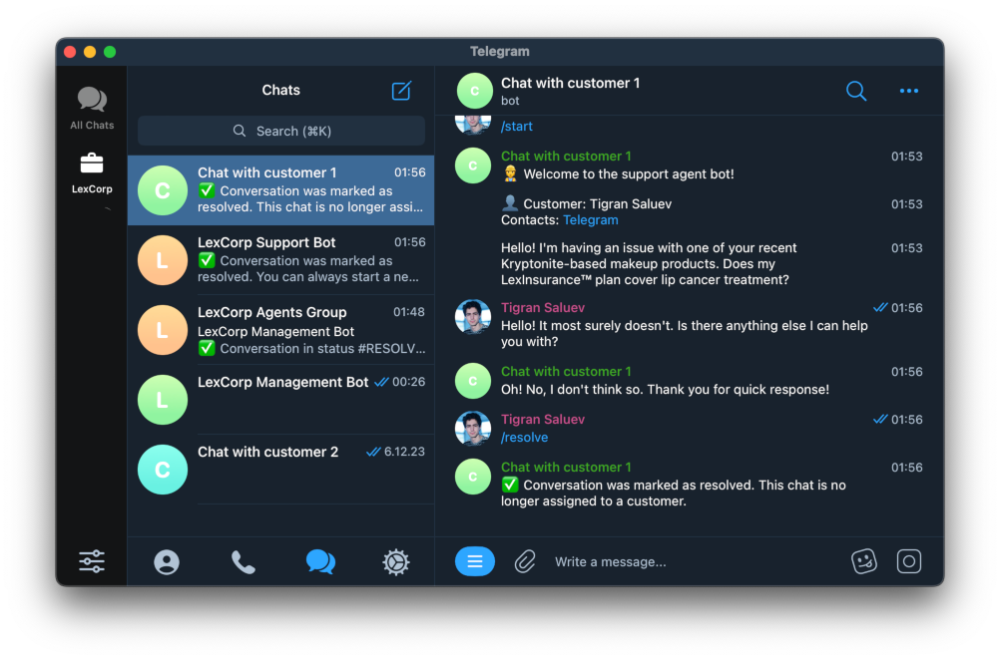
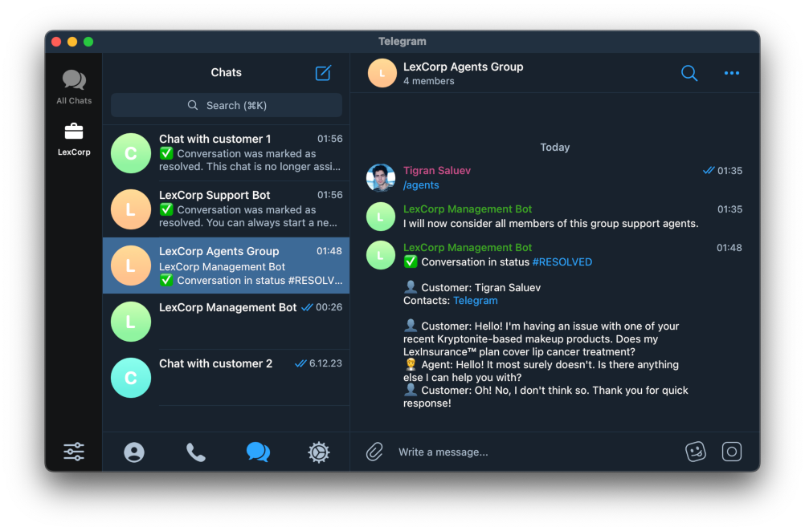

# Quickstart

In this tutorial we'll build a simple Telegram-only support system.

You will need:

1. At least three Telegram bots. **Manager bot** will be used to manage the system, **Customer bot** will
   face customers, and **Agent bot** will be used by agents to chat 
   with the customers (you may call it "Chat with customer").
   <br/><br/>Create them via [BotFather](https://t.me/BotFather) and write down corresponding secret tokens.<br/> 
2. Telegram group where the agents will be notified about new conversations with customers. We will further refer
   to it as **Agent group**.
   <br/><br/>Create it, add **Manager bot** and promote it to **admin**.<br/> 
3. You will have to know **your Telegram user ID** so that the bots can figure out who's the boss.
   <br/><br/>One easy way is to open Telegram Web and find your ID via Chrome Developer Tools, but you are free to 
   find an easier way on the web.

Now, install `suppgram` Python package with some optional dependencies:
```shell
$ pip install suppgram[telegram,sqlalchemy]
```
Write the following lines to a file named `.env`:
```shell
export TELEGRAM_MANAGER_BOT_TOKEN=<secret token of Manager bot>
export TELEGRAM_CUSTOMER_BOT_TOKEN=<secret token of Customer bot>
export TELEGRAM_AGENT_BOT_TOKENS=<secret token of Agent bot>
```
Now add the environment variables to your current environment by using `source` command:
```shell
$ source .env
```
(These tokens are top secret, so we don't want them to stay in your bash history.) 

Now run the all-in-one Suppgram CLI:
```shell
$ python -m suppgram.cli.all_in_one \
         --sqlalchemy-uri sqlite+aiosqlite:///test.db \
         --telegram-owner-id <your Telegram user ID>
```

At this point you should see log similar to this:
```plain
INFO:suppgram.builder:Initializing Telegram customer frontend
INFO:httpx:HTTP Request: POST https://api.telegram.org/bot__MANAGER_BOT_TOKEN__/getMe "HTTP/1.1 200 OK"
INFO:httpx:HTTP Request: POST https://api.telegram.org/bot__MANAGER_BOT_TOKEN__/setMyCommands "HTTP/1.1 200 OK"
INFO:httpx:HTTP Request: POST https://api.telegram.org/bot__CUSTOMER_BOT_TOKEN__/getMe "HTTP/1.1 200 OK"
INFO:httpx:HTTP Request: POST https://api.telegram.org/bot__AGENT_BOT_TOKEN_0__/getMe "HTTP/1.1 200 OK"
INFO:httpx:HTTP Request: POST https://api.telegram.org/bot__AGENT_BOT_TOKEN_0__/setMyCommands "HTTP/1.1 200 OK"
INFO:telegram.ext.Application:Application started
INFO:telegram.ext.Application:Application started
INFO:telegram.ext.Application:Application started
INFO:httpx:HTTP Request: POST https://api.telegram.org/bot__CUSTOMER_BOT_TOKEN__/getUpdates "HTTP/1.1 200 OK"
INFO:httpx:HTTP Request: POST https://api.telegram.org/bot__MANAGER_BOT_TOKEN__/getUpdates "HTTP/1.1 200 OK"
INFO:httpx:HTTP Request: POST https://api.telegram.org/bot__AGENT_BOT_TOKEN_0__/getUpdates "HTTP/1.1 200 OK"
...
```

Now you can go to the **Agents group** and execute `/agents` command:



You may now write something to the **Support bot** — from yourself or any other account:



You will now see a notification about new customer conversation in the **Agent group**:



Click "Assign to me". Since you are a member of **Agent group**, you are considered an agent —
you can conduct conversations with customers. Unless you played with your bots previously,
you should see a warning:



Do what it says — go to the **Agent bot** and click "Start". Once you do this, **Agent bot** will
send you customer's messages:



You can now play for a while, chatting with yourself back and forth. Once you're done, you can 
use `\resolve` command:



You will see that sending messages to **Agent bot** now doesn't do anything good, Also,
conversation status should change in the **Agent group**: 



**That's it**! You have a customer support system now. You can publish link to your **Support bot** anywhere
your customers will see it, add your support agents to **Agent group** and let them do the work.

The system has multiple features remaining outside the scope of this tutorial, read about them further in "Usage" 
section. It is also an open source project designed for extensibility, so if you are familiar with Python programming,
you can read about technical details in "Development" section. Good luck!
